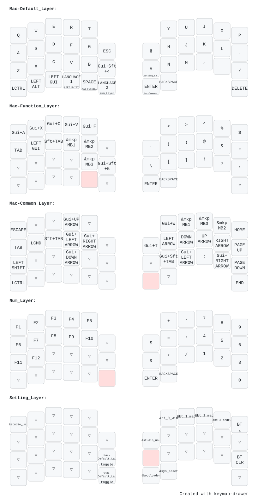
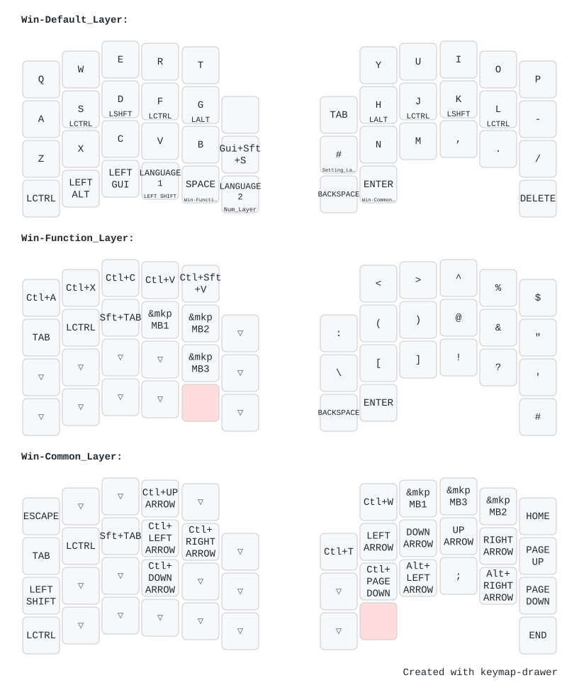

# zmk-config-bobtail

BobTail / BobTailESC のファームウェア。[na-ka-no/zmk-config-BobTail](https://github.com/na-ka-no/zmk-config-BobTail) の fork で、キーマップを [AroundForty-RB](https://github.com/SKoji1117/zmk-config-AroundFortyRB) に合わせてある。

- 右手側が親機（PC と接続する側）。トラックボールも右手側
- エンコーダの回転は Ctrl+→ / Ctrl+←（Mac のデスクトップ切り替え）
- Num キー（左親指の `LANG2`）を押している間、トラックボールがスクロールになる

# Keymaps

## Mac (& NUM & settings)



## Windows



起動時は Mac のレイヤー。Setting レイヤー（右内側の `#` を長押し）の BT 切り替えキーで、接続先と一緒に Mac / Windows が切り替わる。

# ビルド

## ローカル

Docker が要る。`build.yaml` の全ターゲットを、CI と同じ手順でビルドする。

```sh
bash scripts/build-local.sh            # 差分ビルド
PRISTINE=1 bash scripts/build-local.sh # ビルドディレクトリを作り直す
```

uf2 は `~/zmk-ws/zmk-config-bobtail/out/` に出る。Windows のエクスプローラーで開くには、WSL で次を実行する。

```sh
explorer.exe "$(wslpath -w ~/zmk-ws/zmk-config-bobtail/out)"
```

## GitHub Actions

main に push すると走る。Actions の実行結果から `firmware` をダウンロードして解凍する。

どちらの方法でも、次の 3 つができる。

| ファイル | 用途 |
| --- | --- |
| `BobTail_R-seeeduino_xiao_ble-zmk.uf2` | 右手側 |
| `BobTail_L-seeeduino_xiao_ble-zmk.uf2` | 左手側 |
| `settings_reset-seeeduino_xiao_ble-zmk.uf2` | 設定の初期化用 |

`firmware/` には、GitHub Actions でビルドした uf2 を置いてある（`bd97ae4` 時点。キーマップを変えたら差し替える）。

# ファームウェアの適用方法

## キーマップを変えただけのとき

右手側だけ書き込めばよい。

1. 右手側を USB で PC につなぐ
2. ブートローダーに入る。次のどちらか
   - Setting レイヤー（右内側の `#` を長押し）で、右親指の左側のキー（`&bootloader`）を押す
   - 基板のリセットボタンを素早く 2 回押す
3. `XIAO-BLE`（または `XIAO-SENSE`）というドライブが現れるので、`BobTail_R-...uf2` をコピーする
4. コピーが終わるとドライブが自動で消え、新しいファームウェアで再起動する

## シールドの定義や設定（`.overlay`、`.conf`、`.dtsi`、`west.yml`）を変えたとき

左右の両方に書き込む。左手側にはブートローダーに入るキーが無いので、リセットボタンを 2 回押して入り、`BobTail_L-...uf2` をコピーする。

## 左右がつながらなくなったとき、ペアリングをやり直したいとき

1. 左右それぞれに `settings_reset-...uf2` を書き込む
2. 左右それぞれに、本来のファームウェア（`BobTail_L` / `BobTail_R`）を書き込む
3. 左右のリセットボタンを同時に押して、左右をつなぎ直す
4. PC 側で古い Bluetooth の登録を削除し、ペアリングし直す

# 更新手順

1. `config/BobTail.keymap` を編集する（[keymap-editor](https://nickcoutsos.github.io/keymap-editor/) でもよい）
2. `bash scripts/build-local.sh` でビルドが通ることを確かめる
3. main に push する
4. 上の「ファームウェアの適用方法」で書き込む
5. [keymap-drawer](https://keymap-drawer.streamlit.app/) に `.keymap` を読ませて `figs/` の画像を更新し、`firmware/` の uf2 を差し替える

依存（`config/west.yml` の ZMK フォークとトラックボールのドライバ、`.github/workflows/blank.yml` の再利用ワークフロー）は、コミットハッシュに固定してある。上げるときは、ハッシュを書き換えてからローカルビルドで確かめる。
